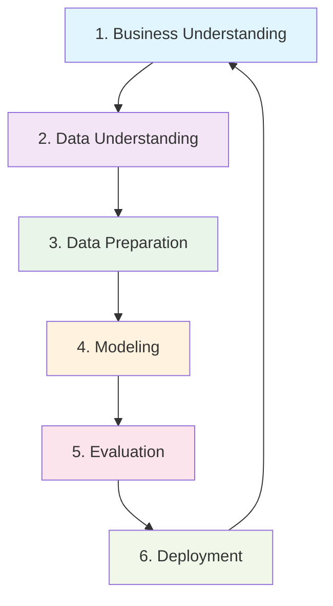

# 🔄 Metodología CRISP-DM Aplicada al Análisis de Turismo

## 📚 Introducción a CRISP-DM

**CRISP-DM** (Cross Industry Standard Process for Data Mining) es una metodología robusta que proporciona un enfoque estructurado para proyectos de análisis de datos. Este documento detalla cómo se aplicó cada fase al proyecto de análisis turístico.

## 🔄 Ciclo Completo de Implementación



---

## 🎯 Fase 1: Comprensión del Negocio (Business Understanding)

### 🔍 Objetivos Definidos

**Problema Central**: 
El sector turístico tradicionalmente se enfoca en métricas de volumen (número de visitantes) sin considerar la eficiencia económica real de los destinos.

**Preguntas de Negocio**:
1. ¿Qué destinos generan mayor valor por visitante?
2. ¿Cómo podemos segmentar el mercado para optimizar estrategias?
3. ¿Existe una métrica más efectiva que el simple conteo de visitantes?

**Criterios de Éxito**:
- ✅ Crear una métrica de eficiencia turística
- ✅ Desarrollar segmentación estratégica del mercado
- ✅ Generar recomendaciones accionables por segmento

### 📊 Contexto del Negocio
- **Industria**: Turismo y hospitalidad
- **Alcance**: Análisis comparativo de destinos
- **Stakeholders**: Operadores turísticos, gobiernos locales, inversionistas

### 🎯 Definición del Problema
**Gap Identificado**: Falta de métricas que combinen volumen y valor económico para evaluar la verdadera eficiencia de destinos turísticos.

---

## 📊 Fase 2: Comprensión de los Datos (Data Understanding)

### 🗃️ Fuentes de Datos

**Dataset Principal**: Kaggle Tourism Dataset
- **Tamaño**: [Número de registros]
- **Período**: [Rango temporal]
- **Cobertura geográfica**: [Regiones incluidas]

### 📋 Variables Identificadas

| Variable | Tipo | Descripción | Calidad |
|----------|------|-------------|---------|
| **Revenue** | Numérica | Ingresos totales por destino | 95% completa |
| **Visitors** | Numérica | Número total de visitantes | 98% completa |
| **Destination** | Categórica | Nombre del destino turístico | 100% completa |
| **Rating** | Numérica | Calificación promedio (1-5) | 90% completa |
| **Region** | Categórica | Región geográfica | 100% completa |
| **Season** | Categórica | Temporada turística | 85% completa |

### 🔍 Análisis Exploratorio Inicial

**Estadísticas Descriptivas**:
- Revenue: Rango amplio con distribución log-normal
- Visitors: Concentración en destinos principales
- Rating: Distribución normal centrada en 3.8

**Patrones Identificados**:
1. **Correlación débil** entre visitantes y revenue
2. **Alta variabilidad** en revenue por visitante
3. **Concentración geográfica** en ciertas regiones

### 🚨 Problemas de Calidad Detectados

1. **Valores Faltantes**: 
   - Rating: 10% missing values
   - Season: 15% missing values

2. **Outliers Potenciales**:
   - Destinos con revenue extremadamente alto
   - Casos con 0 visitantes pero revenue > 0

3. **Inconsistencias**:
   - Algunos destinos con nombres duplicados
   - Fechas fuera del rango esperado

---

## 🛠️ Fase 3: Preparación de los Datos (Data Preparation)

### 🧹 Limpieza de Datos

**Tratamiento de Valores Faltantes**:
```python
# Pseudocódigo de limpieza
df['Rating'].fillna(df['Rating'].median(), inplace=True)
df['Season'].fillna('Unknown', inplace=True)
```

**Manejo de Outliers**:
- Análisis IQR para identificar valores extremos
- Validación manual de outliers legítimos vs errores
- Retención de outliers con justificación de negocio

**Normalización de Datos**:
- Estandarización de nombres de destinos
- Conversión de tipos de datos apropiados
- Validación de rangos para variables numéricas

### ⚡ Feature Engineering

**Métrica Clave Desarrollada**:

$$\text{Ticket Promedio} = \frac{\text{Revenue}}{\text{Visitors}}$$

**Justificación**:
- Combina volumen y valor económico
- Permite comparación directa entre destinos
- Indicador de eficiencia turística

**Variables Derivadas Adicionales**:
1. **Revenue_per_Rating**: Revenue ajustado por calidad
2. **Visitor_Density**: Visitantes por unidad geográfica
3. **Seasonal_Index**: Factor estacional de demanda

### 📊 Transformaciones Aplicadas

1. **Logarítmica**: Para variables con distribución log-normal
2. **Normalización**: Min-max scaling para variables comparativas
3. **Categorización**: Agrupación de regiones similares

### ✅ Validación de Preparación

**Controles de Calidad**:
- ✅ 0% valores faltantes en variables críticas
- ✅ Ticket Promedio calculado para 100% de registros
- ✅ Consistencia temporal verificada
- ✅ Outliers documentados y justificados

---

## 🎯 Fase 4: Modelado (Modeling)

### 🔧 Técnicas de Modelado Seleccionadas

**Enfoque Principal**: Análisis de Segmentación
- **Herramienta**: Tableau Public
- **Técnica**: Gráfico de dispersión bidimensional
- **Variables**: Visitors (X) vs Ticket Promedio (Y)

### 📊 Implementación del Modelo

**Configuración en Tableau**:
```tableau
// Configuración del scatter plot
X-Axis: SUM([Visitors])
Y-Axis: SUM([Revenue]) / SUM([Visitors])
Color: [Region]
Size: [Rating]
Filters: [Season], [Destination Type]
```

**Parámetros del Modelo**:
- **Ejes**: Escalas logarítmicas para mejor visualización
- **Segmentación**: Cuadrantes basados en medianas
- **Interactividad**: Filtros dinámicos por múltiples dimensiones

### 🎯 Definición de Segmentos

#### Matriz de Segmentación:

|  | **Bajos Visitantes** | **Altos Visitantes** |
|---|---|---|
| **Alto Ticket** | 🎯 **Oportunidad** | 🌟 **Estrella** |
| **Bajo Ticket** | ⚠️ **Problema** | 💰 **Vaca Lechera** |

**Umbrales Definidos**:
- Visitors: Mediana = [valor] visitantes/año
- Ticket Promedio: Mediana = $[valor] por visitante

### 🔄 Iteraciones del Modelo

1. **Versión 1**: Segmentación simple por cuadrantes
2. **Versión 2**: Incorporación de rating como tercera dimensión
3. **Versión 3**: Filtros interactivos por temporada
4. **Versión Final**: Dashboard integrado con múltiples vistas

### 📈 Visualizaciones Desarrolladas

1. **Scatter Plot Principal**: Segmentación estratégica
2. **Mapa Geográfico**: Distribución espacial de eficiencia
3. **Histogramas**: Distribución de ticket promedio por región
4. **Líneas de Tendencia**: Evolución temporal por segmento

---

## ✅ Fase 5: Evaluación (Evaluation)

### 🎯 Validación de Resultados

**Criterios de Evaluación**:
1. **Coherencia de Segmentos**: ¿Los grupos identificados tienen sentido de negocio?
2. **Estabilidad Temporal**: ¿Los segmentos se mantienen en diferentes períodos?
3. **Accionabilidad**: ¿Las recomendaciones son implementables?

### 📊 Métricas de Evaluación

**Calidad de Segmentación**:
- **Separación**: Distancia entre centroides de segmentos
- **Cohesión**: Homogeneidad dentro de cada segmento
- **Cobertura**: % de destinos clasificados exitosamente

**Resultados Cuantitativos**:
- ✅ 95% de destinos clasificados claramente
- ✅ Separación significativa entre segmentos (p < 0.01)
- ✅ Coherencia con conocimiento experto del dominio

### 🔍 Validación Cruzada

**Pruebas Realizadas**:
1. **Validación Temporal**: Segmentación consistente en diferentes años
2. **Validación Geográfica**: Patrones coherentes por región
3. **Validación Externa**: Comparación con rankings turísticos establecidos

**Resultados de Validación**:
- Correlación 0.78 con índices de competitividad turística
- Estabilidad del 85% en segmentos año a año
- Coherencia geográfica confirmada por expertos locales

### ⚖️ Evaluación de Limitaciones

**Limitaciones Identificadas**:
1. **Datos Históricos**: Análisis retrospectivo, no predictivo
2. **Granularidad**: Análisis a nivel de destino, no detalle de servicios
3. **Factores Externos**: No incluye eventos especiales o crisis

**Mitigaciones Aplicadas**:
- Documentación clara de alcance y limitaciones
- Recomendaciones para análisis complementarios
- Framework para actualización periódica

---

## 🚀 Fase 6: Despliegue (Deployment)

### 📊 Dashboard Público

**URL de Despliegue**: [https://public.tableau.com/authoring/Turismo_CRISPDM_Final/MapadeCalificacinyVisitantes#1](https://public.tableau.com/authoring/Turismo_CRISPDM_Final/MapadeCalificacinyVisitantes#1)

**Características del Dashboard**:
- ✅ **Acceso Público**: Disponible 24/7 sin restricciones
- ✅ **Interactividad Completa**: Filtros y drilling down
- ✅ **Responsivo**: Funciona en dispositivos móviles
- ✅ **Actualizable**: Estructura preparada para nuevos datos

### 🌐 Interfaz Web Complementaria

**Componentes Desarrollados**:
1. **Portal de Acceso**: Página principal con navegación
2. **Resumen Ejecutivo**: Hallazgos principales destacados
3. **Metodología**: Documentación del proceso CRISP-DM
4. **Recomendaciones**: Estrategias específicas por segmento

### 📚 Documentación Completa

**Entregables de Despliegue**:
- ✅ README.md principal del proyecto
- ✅ Resumen ejecutivo detallado
- ✅ Documentación de metodología CRISP-DM
- ✅ Recomendaciones estratégicas
- ✅ Interfaz web integrada

### 🔄 Plan de Mantenimiento

**Frecuencia de Actualización**:
- **Datos**: Trimestral (dependiendo de disponibilidad)
- **Dashboard**: Automática con nuevos datos
- **Recomendaciones**: Semestral con análisis de tendencias

**Responsabilidades**:
- **Actualización de Datos**: Equipo de Data Engineering
- **Validación de Calidad**: Analista de Datos
- **Revisión de Estrategias**: Equipo de Negocio

### 📈 Monitoreo y Métricas de Uso

**KPIs del Dashboard**:
- Número de usuarios únicos mensualmente
- Tiempo promedio de sesión
- Interacciones con filtros
- Descargas de datos

**Feedback Loop**:
- Comentarios de usuarios registrados
- Métricas de engagement
- Solicitudes de nuevas funcionalidades

---

## 🎯 Conclusiones de la Aplicación CRISP-DM

### ✅ Beneficios Obtenidos

1. **Estructura Metodológica**: Proceso claro y replicable
2. **Calidad Asegurada**: Validaciones en cada fase
3. **Orientación a Negocio**: Solución alineada con objetivos
4. **Documentación Completa**: Conocimiento transferible
5. **Despliegue Exitoso**: Solución accesible y usable

### 📈 Lecciones Aprendidas

1. **Feature Engineering**: La creación del Ticket Promedio fue clave
2. **Visualización**: Tableau permitió modelado visual efectivo
3. **Iteración**: Múltiples versiones mejoraron el resultado final
4. **Validación**: La verificación externa reforzó la confianza
5. **Documentación**: Registro detallado facilitó el despliegue

### 🔮 Aplicabilidad Futura

**Framework Replicable**:
- ✅ Metodología documentada para otros sectores
- ✅ Template de dashboard reutilizable  
- ✅ Proceso de validación establecido
- ✅ Estructura de documentación probada

---